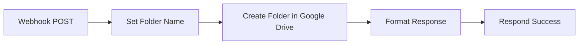

# Create Root Folder - Flujo de n8n

## 📋 Descripción

Este flujo crea la carpeta raíz del sistema en Google Drive. Esta carpeta contendrá toda la jerarquía de carpetas: Universidades → Facultades → Carreras → Cursos → Comisiones → Entregas/Rúbricas.

## 🎯 Propósito

- **Webhook:** `POST /webhook/create-root-folder`
- **Función:** Crear la carpeta raíz "Corrección Automática" en Google Drive
- **Uso:** Se ejecuta una sola vez durante el seed inicial de la base de datos

## 📥 Entrada (Request Body)

```json
{
  "folder_name": "Corrección Automática"
}
```

**Parámetros:**
- `folder_name` (opcional): Nombre de la carpeta raíz. Por defecto: "Corrección Automática"

## 📤 Salida (Response)

### ✅ Success Response

```json
{
  "success": true,
  "folder_url": "https://drive.google.com/drive/u/0/folders/1abc123xyz",
  "folder_id": "1abc123xyz",
  "folder_name": "Corrección Automática",
  "message": "Carpeta raíz creada exitosamente"
}
```

**Campos de respuesta:**
- `success`: `true` si se creó correctamente
- `folder_url`: URL completa de la carpeta en Google Drive
- `folder_id`: ID único de la carpeta en Google Drive
- `folder_name`: Nombre de la carpeta creada
- `message`: Mensaje descriptivo

## 🔄 Flujo de Trabajo



### Nodos:

1. **Webhook - Create Root Folder**
   - Recibe la petición POST con `folder_name`

2. **Set Folder Name**
   - Extrae `folder_name` del body o usa valor por defecto

3. **Create Root Folder in Drive**
   - Crea la carpeta directamente en "My Drive"
   - Retorna: `id`, `name`, `webViewLink`

4. **Format Response**
   - Construye `folder_url` a partir del `id`
   - Prepara los campos de respuesta

5. **Respond Success**
   - Envía la respuesta JSON al backend

## 🚀 Importación e Instalación

### 1. Importar el flujo en n8n

1. Accede a n8n: `http://localhost:5678`
2. Click en el menú (☰) → **Workflows**
3. Click en **Import from File**
4. Selecciona: `n8n-workflows/create-root-folder.json`
5. Click en **Import**

### 2. Configurar credenciales de Google Drive

1. En el flujo importado, haz click en el nodo **"Create Root Folder in Drive"**
2. En **Credentials**, selecciona o crea:
   - **Credential Type:** `Google Drive OAuth2 API`
   - Sigue el proceso de autenticación con tu cuenta de Google
3. Guarda el flujo

### 3. Activar el flujo

1. En la esquina superior derecha, activa el toggle **Active**
2. El flujo ahora está escuchando en: `http://localhost:5678/webhook/create-root-folder`

## 🧪 Probar el Flujo

### Usando curl:

```bash
curl -X POST http://localhost:5678/webhook/create-root-folder \
  -H "Content-Type: application/json" \
  -d '{
    "folder_name": "Corrección Automática"
  }'
```

### Usando Postman:

```
POST http://localhost:5678/webhook/create-root-folder
Content-Type: application/json

{
  "folder_name": "Corrección Automática"
}
```

### Respuesta esperada:

```json
{
  "success": true,
  "folder_url": "https://drive.google.com/drive/u/0/folders/1abc123xyz",
  "folder_id": "1abc123xyz",
  "folder_name": "Corrección Automática",
  "message": "Carpeta raíz creada exitosamente"
}
```

## 🔗 Integración con el Backend

El backend llama a este webhook durante el seed:

```javascript
// backend/scripts/seedDatabase.js
const rootResult = await driveService.createRootFolder('Corrección Automática');

if (rootResult.success && rootResult.folder_url) {
  // Guardar en la base de datos
  await SystemConfig.setValue('root_folder_url', rootResult.folder_url);
}
```

## 📁 Estructura Resultante

Después de ejecutar este flujo, tendrás:

```
📁 My Drive
   └── 📁 Corrección Automática (carpeta raíz creada por este flujo)
       └── (Las universidades se crearán aquí)
```

## 🔍 Validación

Verifica que el flujo funciona correctamente:

1. **En Google Drive:**
   - Accede a tu Google Drive
   - Deberías ver la carpeta "Corrección Automática" en la raíz

2. **En MongoDB:**
   - Verifica que existe el documento en `systemconfigs`:
   ```javascript
   db.systemconfigs.findOne({ key: 'root_folder_url' })
   ```

3. **En el backend:**
   - Los logs del seed deberían mostrar:
   ```
   >>> Creando carpeta raiz del sistema en Google Drive...
   OK  Carpeta raiz creada: https://drive.google.com/drive/u/0/folders/...
   ```

## ⚠️ Notas Importantes

1. **Ejecución única:** Este flujo solo debe ejecutarse una vez durante el seed inicial
2. **Carpetas duplicadas:** Si ejecutas el seed múltiples veces, se crearán carpetas duplicadas. Considera agregar lógica de búsqueda antes de crear
3. **Permisos:** Asegúrate de que la cuenta de Google tiene permisos para crear carpetas
4. **Variable de entorno:** El backend necesita la variable `N8N_CREATE_ROOT_FOLDER_WEBHOOK` configurada

## 🔧 Variables de Entorno Requeridas

**Backend (.env):**
```env
N8N_CREATE_ROOT_FOLDER_WEBHOOK=http://localhost:5678/webhook/create-root-folder
SEED_CREATE_DRIVE_FOLDERS=true
```

**Docker Compose:**
Ya está configurado en `docker-compose.yml`:
```yaml
N8N_CREATE_ROOT_FOLDER_WEBHOOK: http://n8n:5678/webhook/create-root-folder
```

## 📚 Relación con Otros Flujos

Este flujo es el primero en la jerarquía:

1. **create-root-folder.json** ← Crea la carpeta raíz
2. **create-university-folder.json** ← Crea carpetas dentro de la raíz
3. **create-faculty-folder.json**
4. **create-career-folder.json**
5. **create-course-folder.json**
6. **create-commission-folder.json**
7. **create-submission-folder.json**

Todos los flujos posteriores reciben `root_folder_url` para crear carpetas en la ubicación correcta.
